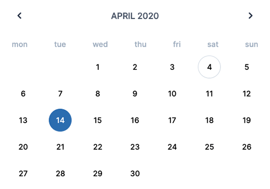

# A calendar build with Laravel Livewire
Example of a calendar with Laravel Livewire



## Usage
```
@livewire('calendar')
```

Available parameters:
- minDate
- maxDate

```
@livewire('calendar', [
    'minDate' => Carbon\Carbon::now()->subMonth(2)->toDateString(),
    'maxDate' => Carbon\Carbon::now()->addMonth(2)->toDateString(),
])
```

## Credits
- [Laravel ](https://laravel.com/)
- [Laravel Livewire](https://laravel-livewire.com/)
- [Tailwind CSS](https://tailwindcss.com/)
- [Heroicons UI](https://github.com/sschoger/heroicons-ui)